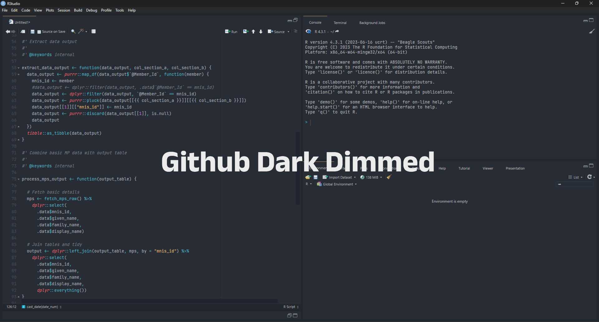

  

# Github Dark Dimmed

Github Dark Dimmed is a simple R Studio theme mimicking popular 'GitHub Dark' themes. The theme was created through the [rsthemes](https://github.com/gadenbuie/rsthemes) package. To use Github Dark Dimmed, download and save the `.rstheme` file in a directory and then add it into R Studio via `Tools > Global Options > Appearance > Add Theme`. 
